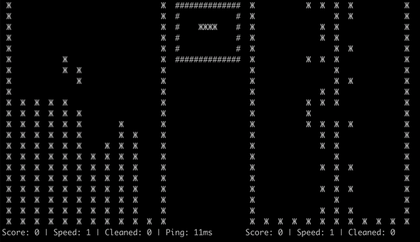
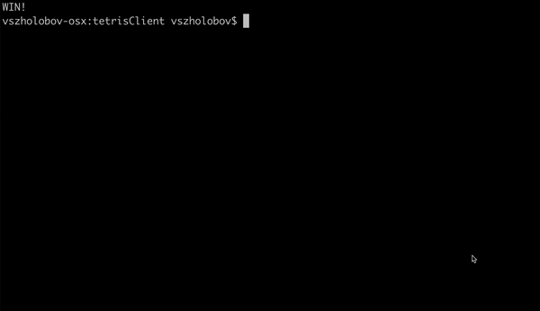

# Tetris Client

## Demo

### Scoring tetris:


### Full Game:


## Guide

### Controls
Controls are realised by buttons:
- a = move piece left
- s = move piece down
- d = move piece right
- q = rotate piece left
- e = rotate piece right

### Launch
Show help menu
```
./tetrisClient help
```

Launch menu
```
./tetrisClient
```

Create new session:
```
./tetrisClient create
```

Connect to existing session:
```
./tetrisClient connect 123456789
```

Show list of existing sessions:
```
./tetrisClient list
```
